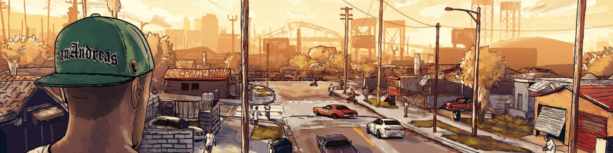
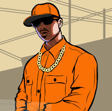

[tensorflow](www.tensorflow.org?target=_blank)

<h1><samp>HI , I am Himanshu from INDIA</samp></h1>

<!---div align="center">
--->

  
  

  

<table style="float:left;">
  <tr><td></td><td><samp><a href="https://github.com/issues?q=is%3Aopen+is%3Aissue+archived%3Afalse+author%3Ahimanshu007-creator">Resume Game</a></samp></td></tr>
  <tr><td></td><td><samp> B.TECH SOPHOMORE (बीटैक) <a href="https://www.davietjal.org/">@DAVIET</a> college</samp></td></tr>
  <tr><td></td><td> <samp> 

Fields

⚡ MAJOR-ELECTRONICS AND COMMUNICATION  💻 MINOR-COMPUTER SCIENCE 

</samp> </td></tr>
    <tr><td></td><td><samp>

Missions passed

<a href="https://hacktoberfest.digitalocean.com/">HACKTOBERFEST</a> <a href="https://devscript.tech/woc/leaderboard/">D'WoC</a> <a href="https://swoc.tech/#:~:text=About%20SWOC,problem%2Dsolving%20in%20real%20time.">S'WoC</a> <a href="https://crosswoc.ieeedtu.in/#">C'WoC</a> <a href="https://mexili.org/winter_of_code/#/winter_of_code">M'WoC</a> <a href="https://gssoc.girlscript.tech/profile.html?id=himanshu007-creator">GSSOC</a>

</samp> </td></tr>
  
   <tr><td></td><td><samp>

Tools/Languages

      
     <code></code>
<code></code>
<code></code>
<code></code>
<code></code>
<code></code>
<code></code>
<code></code>
<code></code>
<code></code> 
 
     

</samp> </td></tr>
  
  
  <tr><td></td><td><samp> 

  
:chart_with_upwards_trend: STATS

   
  
  
   
  <b>Note:</b> This is only a metric of the languages my public code on GitHub consists of and does not reflect my expertise or skill level.
    For more details visit <a href="https://gitstats.me/himanshu007-creator">this</a> site

</samp>  </td></tr>
    <tr><td></td><td> <samp> 

     
  
GitHub Streak:fire:

   
  

   

</samp> </td></tr>
  <tr><td></td><td><samp> 

Socials

  <!-- -->
    
    
     
    
     
       
   
    

</samp> </td></tr>
</table>
  

 

<!--NOTE TO SELF  MAKE YOUR DS & ALGO STRONG!!, GET STARTED!>
<!---[-30302f?style=flat&logo=codechef)]    this will be updated once i start using codechef regularly🤷‍♂️-->

  <table align="center">
    <thead align="center">
        <tr border: none;>
            <td><b>🖥️ Projects</b></td>
            <td><b>🌟 Stars</b></td>
            <td><b>🍴 Forks</b></td>
            <td><b>🐛 Issues</b></td>
            <td><b>🔔 Pull Requests</b></td>
            <td><b>👨‍💻 Language</b></td>
        </tr>
     </thead>
    <tbody>
  <tr>
            <td><a href="https://github.com/himanshu007-creator/SFC-foundations"</a><b>SFC-FOUNDATIONS</b></td>
            <td></td>
            <td></td>
            <td></td>
            <td></td>
            <td></td>
       </tr>
      <tr>
        <td><a href="https://www.facebook.com/sparkarhub/effects/690562661704018/overview/"><b>GTA_AR effect🖼</b></a></td>
        <td>Instagram effect to celebrate vaccination <strong>GTA</strong> style</td>
        <td colspan="4" align="center">Try it here https://cutt.ly/UmZ6IMW</td>
      </tr>
    </tbody>        
</table>
   
 
  

<!---

WORKING ON IT...

--->

<samp><h2>Click the image below to accept the mission</h2></samp>

