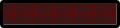
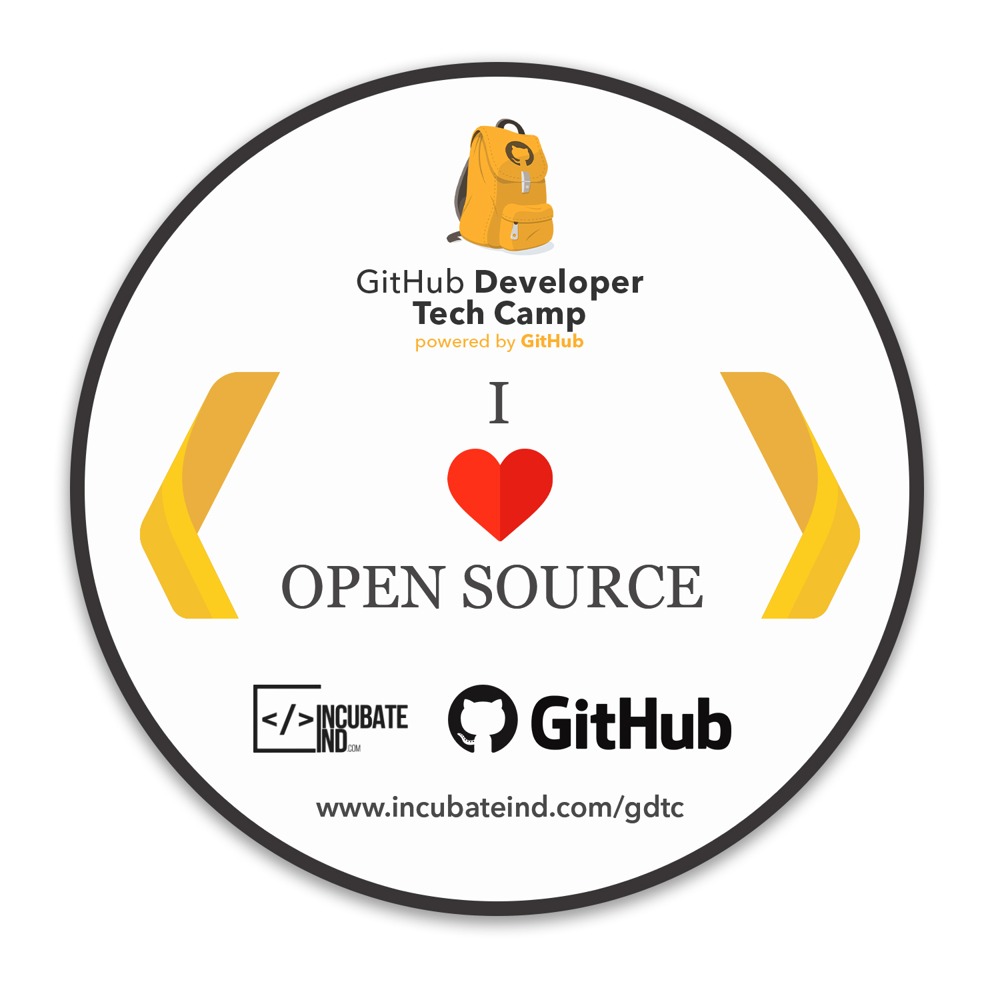
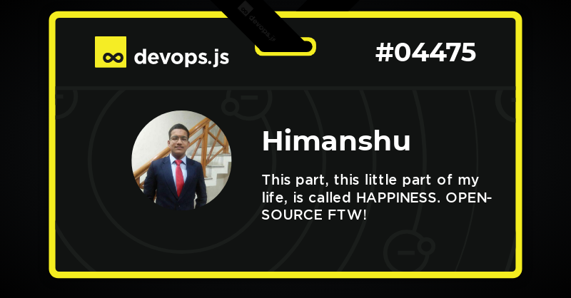

### HI! 
<!---div align="center">
--->

<!-- ### I AM HIMANSHU--> 
- 📚 B.TECH SOPHOMORE (बीटैक) undergrad <a href="https://www.davietjal.org/">@DAVIET</a> college
- ⚡ MAJOR-ELECTRONICS AND COMMUNICATION  💻 MINOR-COMPUTER SCIENCE 
- 🥅 Goals: to <strong>learn new technologies</strong> and <strong>form a community to help first-timers</strong>
- ⚡ Fun fact:I love meeting new people and making connections:full_moon_with_face:
- 💬 Ask me about Anything [here](mailto:addyjeridiq@gmail.com)! I am happy to help.
- 📦 Open-source events -> [<a href="https://hacktoberfest.digitalocean.com/">HACKTOBERFEST</a>,&nbsp; <a href="https://gssoc.girlscript.tech/index.html">GSSOC'21</a>, <a href="https://devscript.tech/woc/leaderboard/">D'WoC</a>,&nbsp;<a href="https://swoc.tech/#:~:text=About%20SWOC,problem%2Dsolving%20in%20real%20time.">S'WoC</a>, <a href="https://crosswoc.ieeedtu.in/#">C'WoC</a>, <a href="https://mexili.org/winter_of_code/#/winter_of_code">M'WoC</a> ]
- 🖥 #2631 in <a href="https://codingcompetitions.withgoogle.com/kickstart">GOOGLE kickstart</a> round H
- ✍ Check out my blogs <a href="https://fuhrer777144529.wordpress.com/">here</a> ( pssst, they are not technical ones🙂)
<!--this is good as well ---><!--- this one looks good, but not much useful-->
<html>
  <head>
    <meta charset='utf-8'>

  
:chart_with_upwards_trend: STATS

   
  
  
   
  <b>Note:</b> This is only a metric of the languages my public code on GitHub consists of and does not reflect my expertise or skill level.

     
  
:fire: GitHub Streak:fire:

   
  

  

 
🔰BADGES🔰

 

 
  
  
  
 
 
 

<!--NOTE TO SELF  MAKE YOUR DS & ALGO STRONG!!, GET STARTED!>
<!---[-30302f?style=flat&logo=codechef)]    this will be updated once i start using codechef regularly🤷‍♂️-->

  

  

 

 

    
  
 

  
  
  
  
  

<a href="https://github.com/himanshu007-creator?tab=repositories"><h3 align="center">Show some &nbsp;❤️&nbsp; by starring some of the repositories!</h3></a>
<!---

WORKING ON IT...

--->

